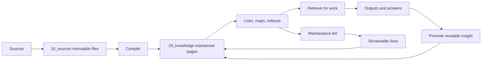

# Knowledge Compounding System Design

## Goal

Build Sam's personal knowledge base as a compounding system, not as a file archive, chat history, or one-off RAG index.

The system continuously turns sources, research, conversations, project work, and high-quality answers into maintained Obsidian knowledge. It should support Sam's daily work first, then later feed public-account writing and other outputs.

## Redesign Premise

This v2 system is a data-first rebuild.

The old project code is not a compatibility boundary. It can be archived, ignored, or replaced. The valuable asset is the existing data and the future Obsidian vault state.

The stable boundaries are:

1. `/Users/samcao/Obsidian/wiki` as the canonical vault.
2. V2 Markdown/frontmatter schemas for sources, knowledge objects, projects, outputs, maps, and machine indexes.
3. Local Knowledge Runner operations for write, compile, search, and maintenance.
4. Command Center task contracts for cloud/local orchestration.

Everything else is implementation detail.

## Karpathy LLM Wiki Interpretation

The system follows Karpathy's LLM Wiki idea:

1. Raw sources are immutable.
2. The wiki is maintained by an LLM agent.
3. The agent follows a protocol for ingesting, querying, linking, reviewing, and linting the wiki.
4. Knowledge is compiled into maintained pages instead of re-derived from raw chunks on every query.
5. Good answers and analyses are filed back into the wiki so exploration compounds.

The important shift is statefulness. A retrieval result is transient; a wiki update is durable.

Reference: https://gist.github.com/karpathy/442a6bf555914893e9891c11519de94f

## Product Shape

The first product is not a web app. The first product is a maintained Obsidian knowledge base plus a local runner that can safely update it.



## Source Of Truth

Obsidian Markdown is the source of truth:

`/Users/samcao/Obsidian/wiki`

Do not introduce a database as the primary knowledge store. Databases, BM25 indexes, vector indexes, OpenViking memories, task logs, and dashboards are derived views.

## System Roles

### Obsidian

Sam's human interface for reading, browsing, editing, and reviewing durable knowledge.

### Personal Knowledge Engine

Local Python project that owns:

- vault configuration
- source ingestion
- knowledge compilation
- retrieval indexes
- search/context packs
- maintenance lint
- operation reports

### Local Knowledge Runner

Local Command Center worker that calls the Personal Knowledge Engine. It is the only automated process allowed to write local Obsidian files.

### Command Center

Task orchestration and review surface. It creates `knowledge_deposit` tasks, asks for review when needed, and shows deposit results. It does not write the vault directly.

### Research Agent

Research production channel. It gathers sources, generates reports, and marks whether the result should be deposited.

### Secretary Agent

Conversation and routing layer. It should classify requests as capture, research, query, deposit, output, scheduling, or project work. If intent is unclear, it should ask Sam before choosing a workflow.

### Output Agent

Later-stage content producer. It creates public-account drafts and briefs from reviewed knowledge/source refs. It must not invent unsupported claims.

## Vault Layers

```text
wiki/
├── 00_inbox/          # temporary capture and triage
├── 10_sources/        # immutable source layer
├── 20_knowledge/      # maintained knowledge objects
├── 30_projects/       # active project context
├── 40_outputs/        # reports, briefs, article drafts, decisions
├── 50_maps/           # human navigation and learning paths
├── 90_archive/        # retained but inactive material
└── _system/           # machine-maintained indexes, manifests, reports
```

Layer rules:

- `00_inbox`: temporary only. Agent triages into proper layers.
- `10_sources`: source bodies are immutable after capture.
- `20_knowledge`: LLM-maintained pages. Merge and update before creating duplicates.
- `30_projects`: project context links to sources and knowledge; it should not duplicate source bodies.
- `40_outputs`: reusable products that cite sources and knowledge.
- `50_maps`: human navigation; retrieval can use them but should not depend only on them.
- `_system`: machine state, not user-facing knowledge.

## Object Model

Keep the schema small. Add fields only when they change behavior.

### Source

```yaml
type: source
source_type: article | paper | book | video | conversation | research_report | work_note | clipping
title: string
source_url: string
source_id: string
domain_hint: ai_agents | product_growth | business_investment | personal_systems | engineering | content_creation
tags: []
status: raw | compiled | reviewed | archived
content_hash: string
collected_at: date
legacy_path: string
origin_task_id: string
```

Rules:

- Body is never silently rewritten.
- Same `content_hash` should not create a duplicate.
- Same `source_id` can update metadata, not source body.
- `legacy_path` is retained for migrated data.

### Knowledge

```yaml
type: knowledge
object_type: concept | map | principle | case | playbook | question | person_org | glossary
domain: ai_agents | product_growth | business_investment | personal_systems | engineering | content_creation
title: string
aliases: []
source_refs: []
status: candidate | reviewed | stable | stale | deprecated
confidence: number
created_at: date
updated_at: date
reviewed_at: date
legacy_path: string
```

Rules:

- Generated pages start as `candidate`.
- Existing pages are updated before new pages are created.
- Every durable claim should trace back to `source_refs` or be marked as Sam's synthesis.
- Contradictions are preserved as explicit tension, not silently erased.

### Output

```yaml
type: output
output_type: research_report | public_article | brief | decision
title: string
source_refs: []
knowledge_refs: []
status: draft | reviewed | published | archived
created_at: date
updated_at: date
```

Rules:

- Outputs cite source and knowledge refs.
- Strong outputs should create or update reusable `20_knowledge` entries.
- Public-account drafts stay in `draft` until evidence checks pass.

## Runtime Loop

### 1. Capture

Inputs:

- manual Obsidian notes
- web clips
- PDFs/books
- videos/transcripts
- Feishu conversations
- Command Center research reports
- daily recurring research tasks

Output:

- source candidate in `00_inbox`, or normalized source in `10_sources`.

Secretary behavior:

- If Sam asks for research, create a research task.
- If Sam asks to save knowledge, create a deposit task.
- If Sam asks a question, retrieve from the wiki first when relevant.
- If the request can mean multiple things, ask one clarification question.

### 2. Normalize

The local runner determines:

- source type
- domain hint
- source id
- content hash
- whether compilation should run
- whether review is required

Output:

- immutable source file under `10_sources`.
- manifest row under `_system/manifests`.

### 3. Compile

The compiler reads one source and updates `20_knowledge`.

It extracts only durable objects:

- concepts
- principles
- cases
- playbooks
- open questions
- map updates

It should not turn every paragraph into a note.

### 4. Weave

After compilation:

- add wikilinks between related concepts.
- update domain maps.
- detect duplicates and near-duplicates.
- attach source refs.
- connect project/output pages when useful.

This is the compounding layer. Value comes from links, synthesis, contradictions, and reusable principles, not from summaries alone.

### 5. Review

Review levels:

- `candidate`: generated and usable with caution.
- `reviewed`: checked by Sam or a trusted agent pass.
- `stable`: repeatedly useful and safe to reuse.
- `stale`: needs review because assumptions changed.
- `deprecated`: retained for history but should not guide future work.

Review surfaces:

- Obsidian for manual reading.
- Feishu/Command Center for task-level approval and deposit reports.

### 6. Index

Default retrieval stack:

1. per-domain BM25 index
2. frontmatter filters
3. link graph expansion
4. source manifest lookup
5. map/index page hints

Optional later:

- local embedding rerank
- compact OpenViking memory mirror

Vectors must not be required for writes. Markdown plus frontmatter plus BM25 is enough at the current scale.

### 7. Retrieve

When Sam or an agent asks a question:

1. infer domain and task intent.
2. read relevant maps/indexes.
3. search per-domain BM25.
4. expand through links.
5. answer with citations to local source/knowledge files.
6. propose saving the answer if it creates reusable synthesis.

Important rule: a good answer should not disappear into chat.

It should become one of:

- concept update
- case
- principle
- playbook
- project decision
- public article seed

### 8. Maintain

The local runner periodically creates reviewable maintenance issues:

- orphan knowledge pages
- duplicate concepts
- missing source refs
- stale entries
- contradictions
- low-confidence pages
- uncompiled sources
- disconnected project pages
- maps missing important concepts

Maintenance should propose small patches. It should not silently rewrite large parts of the vault.

## Command Center Integration

### Knowledge Deposit Task

Task scenario:

`knowledge_deposit`

Payload:

```json
{
  "source_id": "task_or_artifact_id",
  "title": "source title",
  "body": "markdown body",
  "source_type": "research_report",
  "domain_hint": "ai_agents",
  "tags": ["research", "ai"],
  "source_url": "artifact link",
  "review_required": true
}
```

Flow:

1. research task completes.
2. review card includes `沉淀到知识库`.
3. Command Center creates a `knowledge_deposit` task.
4. Local Knowledge Runner polls and executes it.
5. runner writes source into `10_sources`.
6. runner compiles useful knowledge into `20_knowledge`.
7. runner rebuilds affected indexes.
8. runner returns a deposit report.
9. Command Center/Feishu shows created, updated, skipped, and review-required pages.

### Retrieval For Future Tasks

Before a future research task starts:

- Command Center asks the local runner for a compact context pack.
- The runner retrieves reviewed/stable knowledge first.
- Candidate pages can be included only with status clearly marked.
- The cloud research agent receives compact context, not the whole vault.

### OpenViking Role

OpenViking is not the knowledge base.

Use it only for compact, confirmed operational memory:

- Sam preferences
- stable principles
- high-value cases
- recurring project facts
- task routing rules

Full sources and full wiki entries remain in Obsidian Markdown.

## Storage And Retrieval Efficiency

Use locality first:

- Store source files by source type under `10_sources`.
- Store knowledge by domain and object type under `20_knowledge/domains/{domain}`.
- Build BM25 indexes per domain under `_system/indexes/{domain}`.
- Rebuild only touched domains after ingest.
- Load maps and top-k pages, not the whole vault.

Avoid heavy infrastructure until there is measured need:

- no primary custom database
- no mandatory vector database
- no graph service
- no always-on web API unless local CLI becomes insufficient
- no automatic public publishing

## Legacy Policy

Old data matters. Old code does not.

Migration keeps:

- source content
- compiled knowledge pages
- useful links/frontmatter where available
- `legacy_path` for traceability
- migration manifest

Migration does not preserve:

- old directory names as product constraints
- old script APIs
- old server structure
- old search implementation
- old compiler abstractions

The new implementation should be judged by the v2 vault contract and end-to-end workflows, not by compatibility with legacy code.

## Roadmap

### Phase 0: Data Cutover

Status: mostly done.

Goal:

- migrated data exists in `/Users/samcao/Obsidian/wiki`
- old data remains traceable through `legacy_path` and manifests
- old local files are archived or ignored

### Phase 1: Local Engine Stabilization

Goal:

- source ingestion is idempotent
- compilation can create/update knowledge objects
- indexes are rebuilt by domain
- v2 code does not depend on legacy modules

Acceptance:

- unit tests pass.
- a source can be ingested, compiled, indexed, and searched from CLI.

### Phase 2: Command Center Deposit Loop

Goal:

- research output can be deposited with one review action.
- local runner returns a useful deposit report.

Acceptance:

- `knowledge_deposit` task runs locally.
- duplicated deposit is skipped by hash.
- Feishu/Command Center displays created/updated/skipped pages.

### Phase 3: Query And Context Packs

Goal:

- agents can use the wiki before research and project work.

Acceptance:

- context pack API/CLI returns cited reviewed/stable pages.
- candidate status is visible.
- answers can be promoted back into the vault.

### Phase 4: Autonomous Maintenance

Goal:

- the wiki can clean, link, and organize itself through reviewable changes.

Acceptance:

- lint detects orphan, duplicate, stale, uncompiled, and missing-source issues.
- maintenance reports list exact proposed file changes.
- broad rewrites require Sam review.

### Phase 5: Public Account Pipeline

Goal:

- reviewed knowledge becomes article topics, outlines, and drafts.

Acceptance:

- drafts live under `40_outputs/public_articles`.
- unsupported claims are flagged.
- every draft cites sources and knowledge refs.

## Operating Rule

Every useful interaction should end in one of five states:

1. source captured
2. knowledge updated
3. output created
4. maintenance issue queued
5. explicit decision not to store

If none of these happens, the interaction did not compound.
